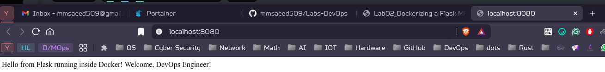

Install app dependencies

```bash
$ pip install -r requirements.txt

WARNING: Ignoring invalid distribution ~ip (/home/o0xwolf/.local/share/pip/lib/python3.13/site-packages)
Collecting Flask==3.0.3 (from -r requirements.txt (line 1))
  Downloading flask-3.0.3-py3-none-any.whl.metadata (3.2 kB)
Collecting Werkzeug>=3.0.0 (from Flask==3.0.3->-r requirements.txt (line 1))
  Downloading werkzeug-3.1.3-py3-none-any.whl.metadata (3.7 kB)
Collecting Jinja2>=3.1.2 (from Flask==3.0.3->-r requirements.txt (line 1))
  Downloading jinja2-3.1.6-py3-none-any.whl.metadata (2.9 kB)
Collecting itsdangerous>=2.1.2 (from Flask==3.0.3->-r requirements.txt (line 1))
  Downloading itsdangerous-2.2.0-py3-none-any.whl.metadata (1.9 kB)
Requirement already satisfied: click>=8.1.3 in /home/o0xwolf/.local/share/pip/lib/python3.13/site-packages (from Flask==3.0.3->-r requirements.txt (line 1)) (8.2.1)
Collecting blinker>=1.6.2 (from Flask==3.0.3->-r requirements.txt (line 1))
  Downloading blinker-1.9.0-py3-none-any.whl.metadata (1.6 kB)
Collecting MarkupSafe>=2.0 (from Jinja2>=3.1.2->Flask==3.0.3->-r requirements.txt (line 1))
  Downloading markupsafe-3.0.3-cp313-cp313-manylinux2014_x86_64.manylinux_2_17_x86_64.manylinux_2_28_x86_64.whl.metadata (2.7 kB)
Downloading flask-3.0.3-py3-none-any.whl (101 kB)
Downloading blinker-1.9.0-py3-none-any.whl (8.5 kB)
Downloading itsdangerous-2.2.0-py3-none-any.whl (16 kB)
Downloading jinja2-3.1.6-py3-none-any.whl (134 kB)
Downloading markupsafe-3.0.3-cp313-cp313-manylinux2014_x86_64.manylinux_2_17_x86_64.manylinux_2_28_x86_64.whl (22 kB)
Downloading werkzeug-3.1.3-py3-none-any.whl (224 kB)
WARNING: Ignoring invalid distribution ~ip (/home/o0xwolf/.local/share/pip/lib/python3.13/site-packages)
Installing collected packages: MarkupSafe, itsdangerous, blinker, Werkzeug, Jinja2, Flask
WARNING: Ignoring invalid distribution ~ip (/home/o0xwolf/.local/share/pip/lib/python3.13/site-packages)
Successfully installed Flask-3.0.3 Jinja2-3.1.6 MarkupSafe-3.0.3 Werkzeug-3.1.3 blinker-1.9.0 itsdangerous-2.2.0
```

Run App

```bash
$ python app.py                                                                                        master ✭
 * Serving Flask app 'app'
 * Debug mode: off
WARNING: This is a development server. Do not use it in a production deployment. Use a production WSGI server instead.
 * Running on all addresses (0.0.0.0)
 * Running on http://127.0.0.1:5000
 * Running on http://192.168.1.17:5000
Press CTRL+C to quit
```

Build the image

```bash
$ docker build -t flask-microservice:v1
DEPRECATED: The legacy builder is deprecated and will be removed in a future release.
            Install the buildx component to build images with BuildKit:
            https://docs.docker.com/go/buildx/

Sending build context to Docker daemon  10.24kB
Step 1/7 : FROM python:3.11-slim
3.11-slim: Pulling from library/python
8c7716127147: Already exists
c72c56726626: Pulling fs layer
76d93c681ade: Pulling fs layer
80061c640d63: Pulling fs layer
80061c640d63: Verifying Checksum
80061c640d63: Download complete
c72c56726626: Verifying Checksum
c72c56726626: Download complete
c72c56726626: Pull complete
76d93c681ade: Verifying Checksum
76d93c681ade: Download complete
76d93c681ade: Pull complete
80061c640d63: Pull complete
Digest: sha256:ff8533f48e12b705fc20d339fde2ec61d0b234dd9366bab3bc84d7b70a45c8c0
Status: Downloaded newer image for python:3.11-slim
 ---> 7bbe597de5c7
Step 2/7 : WORKDIR /app
 ---> Running in 9192b5ddf20b
 ---> Removed intermediate container 9192b5ddf20b
 ---> 68ef2c7e5acc
Step 3/7 : COPY app/requirements.txt .
 ---> bff8d442f5b7
Step 4/7 : RUN pip install -r requirements.txt
 ---> Running in 3ad2b62727d3
Collecting Flask==3.0.3 (from -r requirements.txt (line 1))
  Downloading flask-3.0.3-py3-none-any.whl.metadata (3.2 kB)
Collecting Werkzeug>=3.0.0 (from Flask==3.0.3->-r requirements.txt (line 1))
  Downloading werkzeug-3.1.3-py3-none-any.whl.metadata (3.7 kB)
Collecting Jinja2>=3.1.2 (from Flask==3.0.3->-r requirements.txt (line 1))
  Downloading jinja2-3.1.6-py3-none-any.whl.metadata (2.9 kB)
Collecting itsdangerous>=2.1.2 (from Flask==3.0.3->-r requirements.txt (line 1))
  Downloading itsdangerous-2.2.0-py3-none-any.whl.metadata (1.9 kB)
Collecting click>=8.1.3 (from Flask==3.0.3->-r requirements.txt (line 1))
  Downloading click-8.3.0-py3-none-any.whl.metadata (2.6 kB)
Collecting blinker>=1.6.2 (from Flask==3.0.3->-r requirements.txt (line 1))
  Downloading blinker-1.9.0-py3-none-any.whl.metadata (1.6 kB)
Collecting MarkupSafe>=2.0 (from Jinja2>=3.1.2->Flask==3.0.3->-r requirements.txt (line 1))
  Downloading markupsafe-3.0.3-cp311-cp311-manylinux2014_x86_64.manylinux_2_17_x86_64.manylinux_2_28_x86_64.whl.metadata (2.7 kB)
Downloading flask-3.0.3-py3-none-any.whl (101 kB)
   ━━━━━━━━━━━━━━━━━━━━━━━━━━━━━━━━━━━━━━━ 101.7/101.7 kB 339.2 kB/s eta 0:00:00
Downloading blinker-1.9.0-py3-none-any.whl (8.5 kB)
Downloading click-8.3.0-py3-none-any.whl (107 kB)
   ━━━━━━━━━━━━━━━━━━━━━━━━━━━━━━━━━━━━━━━ 107.3/107.3 kB 851.4 kB/s eta 0:00:00
Downloading itsdangerous-2.2.0-py3-none-any.whl (16 kB)
Downloading jinja2-3.1.6-py3-none-any.whl (134 kB)
   ━━━━━━━━━━━━━━━━━━━━━━━━━━━━━━━━━━━━━━━ 134.9/134.9 kB 539.0 kB/s eta 0:00:00
Downloading werkzeug-3.1.3-py3-none-any.whl (224 kB)
   ━━━━━━━━━━━━━━━━━━━━━━━━━━━━━━━━━━━━━━━━ 224.5/224.5 kB 1.7 MB/s eta 0:00:00
Downloading markupsafe-3.0.3-cp311-cp311-manylinux2014_x86_64.manylinux_2_17_x86_64.manylinux_2_28_x86_64.whl (22 kB)
Installing collected packages: MarkupSafe, itsdangerous, click, blinker, Werkzeug, Jinja2, Flask
Successfully installed Flask-3.0.3 Jinja2-3.1.6 MarkupSafe-3.0.3 Werkzeug-3.1.3 blinker-1.9.0 click-8.3.0 itsdangerous-2.2.0
WARNING: Running pip as the 'root' user can result in broken permissions and conflicting behaviour with the system package manager. It is recommended to use a virtual environment instead: https://pip.pypa.io/warnings/venv

[notice] A new release of pip is available: 24.0 -> 25.2
[notice] To update, run: pip install --upgrade pip
 ---> Removed intermediate container 3ad2b62727d3
 ---> 80f5b3b62795
Step 5/7 : COPY app/app.py .
 ---> 692049939766
Step 6/7 : EXPOSE 5000
 ---> Running in 223b68ca942c
 ---> Removed intermediate container 223b68ca942c
 ---> 93833d0d7191
Step 7/7 : CMD ["python", "app.py"]
 ---> Running in a3b786cd1f45
 ---> Removed intermediate container a3b786cd1f45
 ---> 00370284db60
Successfully built 00370284db60
Successfully tagged flask-microservice:v1
```

run the image

```bash
$ docker run -d -p 8080:5000 --name flask-app flask-microservice:v1
d0b7424ccf369c47b91b2f6f69f836dfd677f9477333760ed9e0dff3c7e42a08
```

test app

```bash
$ curl http://localhost:8080

Hello from Flask running inside Docker! Welcome, DevOps Engineer!%                                                                         
```

