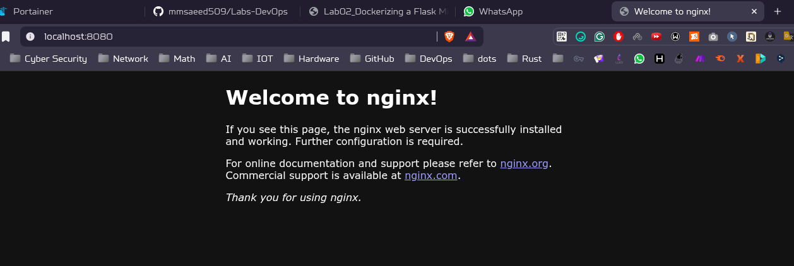
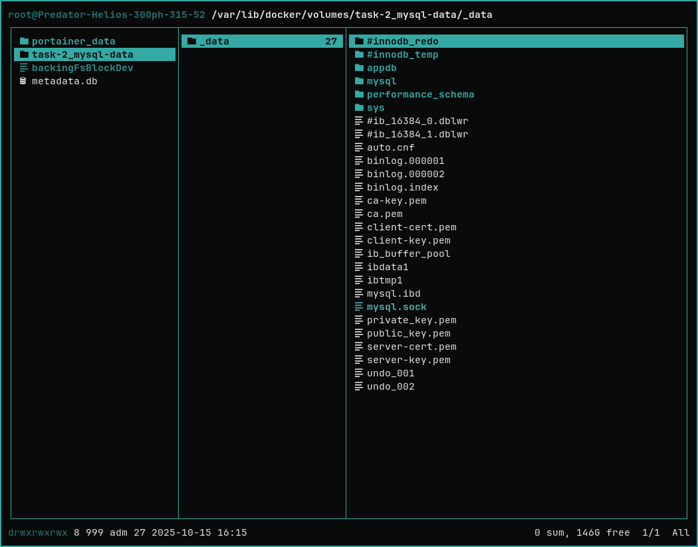

Run 

```bash
$ docker-compose up -d

WARN[0000] /home/o0xwolf/GitHub-SSD/Labs-DevOps/Lab-2/Task-2/docker-compose.yml: the attribute `version` is obsolete, it will be ignored, please remove it to avoid potential confusion 

[+] Running 21/21
✔ nginx Pulled               176.5s 
✔ mysql_db Pulled            161.1s 

[+] Running 4/4
 ✔ Network task-2_app-net    Created                     0.0s
 ✔ Volume task-2_mysql-data  Created                     0.0s
 ✔ Container mysql-database  Started                     0.3s
 ✔ Container nginx-server    Started                     0.4s
```

test app

```bash
$ curl -s http://localhost:8080
<!DOCTYPE html>
<html>
<head>
<title>Welcome to nginx!</title>
<style>
html { color-scheme: light dark; }
body { width: 35em; margin: 0 auto;
font-family: Tahoma, Verdana, Arial, sans-serif; }
</style>
</head>
<body>
<h1>Welcome to nginx!</h1>
<p>If you see this page, the nginx web server is successfully installed and
working. Further configuration is required.</p>

<p>For online documentation and support please refer to
<a href="http://nginx.org/">nginx.org</a>.<br/>
Commercial support is available at
<a href="http://nginx.com/">nginx.com</a>.</p>

<p><em>Thank you for using nginx.</em></p>
</body>
</html>
```



Test communication

```bash
$ docker exec nginx-server ping -c 4 mysql_db                                                                                 master ✭
PING mysql_db (172.23.0.2): 56 data bytes
64 bytes from 172.23.0.2: seq=0 ttl=64 time=0.039 ms
64 bytes from 172.23.0.2: seq=1 ttl=64 time=0.133 ms
64 bytes from 172.23.0.2: seq=2 ttl=64 time=0.048 ms
64 bytes from 172.23.0.2: seq=3 ttl=64 time=0.039 ms

--- mysql_db ping statistics ---
4 packets transmitted, 4 packets received, 0% packet loss
round-trip min/avg/max = 0.039/0.064/0.133 ms
```

Volume
```bash
sudo ranger /var/lib/docker
```


Remove containers

```bash
WARN[0000] /home/o0xwolf/GitHub-SSD/Labs-DevOps/Lab-2/Task-2/docker-compose.yml: the attribute `version` is obsolete, it will be ignored, please remove it to avoid potential confusion 

[+] Running 3/3
 ✔ Container nginx-server    Removed                    0.2s
 ✔ Container mysql-database  Removed                    1.3s
 ✔ Network task-2_app-net    Removed                    0.1s    
```

Run containers again to test data Persistence

```bash
$ docker compose up -d
WARN[0000] /home/o0xwolf/GitHub-SSD/Labs-DevOps/Lab-2/Task-2/docker-compose.yml: the attribute `version` is obsolete, it will be ignored, please remove it to avoid potential confusion

[+] Running 3/3
✔ Network task-2_app-net    Created          0.0s
✔ Container mysql-database  Started          0.2s
✔ Container nginx-server    Started          0.3s   


$ curl -s http://localhost:8080 

<!DOCTYPE html>
<html>
<head>
<title>Welcome to nginx!</title>
<style>
html { color-scheme: light dark; }
body { width: 35em; margin: 0 auto;
font-family: Tahoma, Verdana, Arial, sans-serif; }
</style>
</head>
<body>
<h1>Welcome to nginx!</h1>
<p>If you see this page, the nginx web server is successfully installed and
working. Further configuration is required.</p>

<p>For online documentation and support please refer to
<a href="http://nginx.org/">nginx.org</a>.<br/>
Commercial support is available at
<a href="http://nginx.com/">nginx.com</a>.</p>

<p><em>Thank you for using nginx.</em></p>
</body>
</html>
```