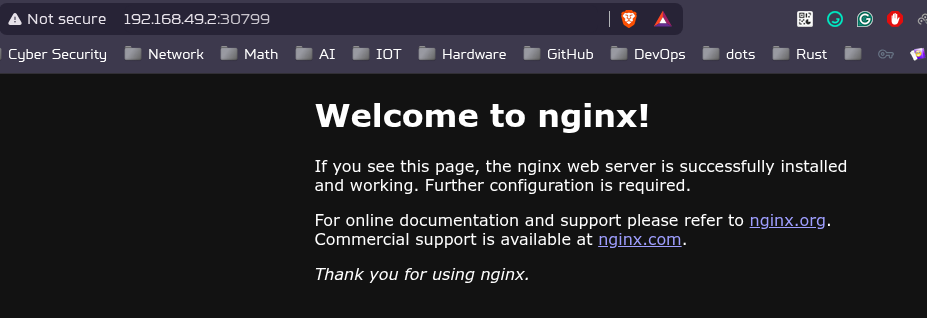

### Create web-app Namespace

```bash
$ kubectl apply -f 

namespace/web-app created

$ kubectl get namespaces

NAME              STATUS   AGE
default           Active   163m
kube-node-lease   Active   163m
kube-public       Active   163m
kube-system       Active   163m
web-app           Active   18s
```

### Deploy Nginx eployment and Service
```bash
$ kubectl apply -f nginx-deployment.yaml -f nginx-service.yaml                                       

deployment.apps/nginx-deployment created
service/nginx-service created

$ kubectl get pods -n web-app                                                                          

NAME                               READY   STATUS    RESTARTS   AGE
nginx-deployment-c6c897f54-bws2t   1/1     Running   0          52s
nginx-deployment-c6c897f54-jrz9x   1/1     Running   0          52s

```


### Test Connectivity
```bash
# Get NodePort
$ kubectl get service nginx-service -n web-app

NAME            TYPE       CLUSTER-IP      EXTERNAL-IP   PORT(S)        AGE
nginx-service   NodePort   10.97.207.246   <none>        80:30799/TCP   117s

# Get Node IP
$ kubectl get nodes -o wide

NAME       STATUS   ROLES           AGE    VERSION   INTERNAL-IP    EXTERNAL-IP   OS-IMAGE             KERNEL-VERSION   CONTAINER-RUNTIME
minikube   Ready    control-plane   168m   v1.34.0   192.168.49.2   <none>        Ubuntu 22.04.5 LTS   6.17.2-arch1-1   docker://28.4.0

# Test access
$ curl http://192.168.49.2:30799/

<!DOCTYPE html>
<html>
<head>
<title>Welcome to nginx!</title>
<style>
html { color-scheme: light dark; }
body { width: 35em; margin: 0 auto;
font-family: Tahoma, Verdana, Arial, sans-serif; }
</style>
</head>
<body>
<h1>Welcome to nginx!</h1>
<p>If you see this page, the nginx web server is successfully installed and
working. Further configuration is required.</p>

<p>For online documentation and support please refer to
<a href="http://nginx.org/">nginx.org</a>.<br/>
Commercial support is available at
<a href="http://nginx.com/">nginx.com</a>.</p>

<p><em>Thank you for using nginx.</em></p>
</body>
</html>

# Get the URL
$ minikube service nginx-service -n web-app                                                            master ✭
┌───────────┬───────────────┬─────────────┬───────────────────────────┐
│ NAMESPACE │     NAME      │ TARGET PORT │            URL            │
├───────────┼───────────────┼─────────────┼───────────────────────────┤
│ web-app   │ nginx-service │ 80          │ http://192.168.49.2:30799 │
└───────────┴───────────────┴─────────────┴───────────────────────────┘
🎉  Opening service web-app/nginx-service in default browser...
Opening in existing browser session.
```


### Scale Deployment
```bash
# Scale to 3 replicas
$ kubectl scale deployment nginx-deployment -n web-app --replicas=3

deployment.apps/nginx-deployment scaled

$ kubectl get pods -n web-app

NAME                               READY   STATUS    RESTARTS   AGE
nginx-deployment-c6c897f54-5qbdw   1/1     Running   0          25s
nginx-deployment-c6c897f54-bws2t   1/1     Running   0          9m26s
nginx-deployment-c6c897f54-jrz9x   1/1     Running   0          9m26s

# Scale to 4 replicas
$ kubectl scale deployment nginx-deployment -n web-app --replicas=4

deployment.apps/nginx-deployment scaled

$ kubectl get pods -n web-app

NAME                               READY   STATUS              RESTARTS   AGE
nginx-deployment-c6c897f54-5qbdw   1/1     Running             0          42s
nginx-deployment-c6c897f54-bws2t   1/1     Running             0          9m43s
nginx-deployment-c6c897f54-fjwcw   0/1     ContainerCreating   0          2s
nginx-deployment-c6c897f54-jrz9x   1/1     Running             0          9m43s
```

### Apply ResourceQuota
```bash
$ kubectl apply -f quota.yaml

resourcequota/web-app-quota created

$ kubectl describe resourcequota web-app-quota -n web-app

Name:            web-app-quota
Namespace:       web-app
Resource         Used   Hard
--------         ----   ----
limits.cpu       800m   1
limits.memory    1Gi    2Gi
pods             4      5
requests.cpu     400m   500m
requests.memory  512Mi  1Gi

$ kubectl get resourcequota -n web-app

NAME            REQUEST                                                          LIMIT                                        AGE
web-app-quota   pods: 4/5, requests.cpu: 400m/500m, requests.memory: 512Mi/1Gi   limits.cpu: 800m/1, limits.memory: 1Gi/2Gi   48s
```

### Test Quota Enforcement
```bash
# Try to scale beyond quota limits (should fail or be limited)
$ kubectl scale deployment nginx-deployment -n web-app --replicas=15

deployment.apps/nginx-deployment scaled

$ kubectl get pods -n web-app

NAME                               READY   STATUS    RESTARTS   AGE
nginx-deployment-c6c897f54-5qbdw   1/1     Running   0          4m16s
nginx-deployment-c6c897f54-9ckrl   1/1     Running   0          34s
nginx-deployment-c6c897f54-bws2t   1/1     Running   0          13m
nginx-deployment-c6c897f54-fjwcw   1/1     Running   0          3m36s
nginx-deployment-c6c897f54-jrz9x   1/1     Running   0          13m

$ kubectl describe resourcequota web-app-quota -n web-app

Name:            web-app-quota
Namespace:       web-app
Resource         Used    Hard
--------         ----    ----
limits.cpu       1       1
limits.memory    1280Mi  2Gi
pods             5       5
requests.cpu     500m    500m
requests.memory  640Mi   1Gi

```

### Verify All Resources
```bash
$ kubectl get all -n web-app

NAME                                   READY   STATUS    RESTARTS   AGE
pod/nginx-deployment-c6c897f54-5qbdw   1/1     Running   0          5m46s
pod/nginx-deployment-c6c897f54-9ckrl   1/1     Running   0          2m4s
pod/nginx-deployment-c6c897f54-bws2t   1/1     Running   0          14m
pod/nginx-deployment-c6c897f54-fjwcw   1/1     Running   0          5m6s
pod/nginx-deployment-c6c897f54-jrz9x   1/1     Running   0          14m

NAME                    TYPE       CLUSTER-IP      EXTERNAL-IP   PORT(S)        AGE
service/nginx-service   NodePort   10.97.207.246   <none>        80:30799/TCP   14m

NAME                               READY   UP-TO-DATE   AVAILABLE   AGE
deployment.apps/nginx-deployment   5/15    5            5           14m

NAME                                         DESIRED   CURRENT   READY   AGE
replicaset.apps/nginx-deployment-c6c897f54   15        5         5       14m

$ kubectl get resourcequota -n web-app

NAME            REQUEST                                                          LIMIT                                        AGE
web-app-quota   pods: 5/5, requests.cpu: 500m/500m, requests.memory: 640Mi/1Gi   limits.cpu: 1/1, limits.memory: 1280Mi/2Gi   5m2s

$ kubectl describe namespace web-app

Name:         web-app
Labels:       kubernetes.io/metadata.name=web-app
Annotations:  <none>
Status:       Active

Resource Quotas
  Name:            web-app-quota
  Resource         Used    Hard
  --------         ---     ---
  limits.cpu       1       1
  limits.memory    1280Mi  2Gi
  pods             5       5
  requests.cpu     500m    500m
  requests.memory  640Mi   1Gi

No LimitRange resource.
```

### Create db-app Namespace
```bash
$ kubectl apply -f db-namespace.yaml

namespace/db-app created

$ kubectl get namespaces

NAME              STATUS   AGE
db-app            Active   44s
default           Active   3h1m
kube-node-lease   Active   3h1m
kube-public       Active   3h1m
kube-system       Active   3h1m
web-app           Active   18m

```

### Deploy MySQL
```bash
$ kubectl apply -f mysql-deployment.yaml

deployment.apps/mysql-deployment created

$ kubectl get pods -n db-app

NAME                                READY   STATUS              RESTARTS   AGE
mysql-deployment-764994d6d7-2xlsf   0/1     ContainerCreating   0          25s

$ kubectl get deployments -n db-app
NAME               READY   UP-TO-DATE   AVAILABLE   AGE
mysql-deployment   0/1     1            0           36s
```

### Verify MySQL Environment Variables
```bash
# Check environment variables in the deployment
$ kubectl get deployment mysql-deployment -n db-app -o yaml

      - env:
        - name: MYSQL_ROOT_PASSWORD
          value: rootpassword
        - name: MYSQL_DATABASE
          value: mydb
        image: mysql:latest
        imagePullPolicy: Always
        name: mysql
        ports:
        - containerPort: 3306
          protocol: TCP


# Verify inside the pod
kubectl exec -it $(kubectl get pod -n db-app -l app=mysql -o jsonpath='{.items[0].metadata.name}') -n db-app -- env | grep MYSQL

MYSQL_ROOT_PASSWORD=rootpassword
MYSQL_DATABASE=mydb
MYSQL_MAJOR=innovation
MYSQL_VERSION=9.4.0-1.el9
MYSQL_SHELL_VERSION=9.4.0-1.el9
```

## Cleanup

```bash
# Delete All resources
$ kubectl delete -f db-namespace.yaml -f mysql-deployment.yaml -f nginx-deployment.yaml -f nginx-service.yaml -f  quota.yaml -f webapp-namespace.yaml

namespace "db-app" deleted
deployment.apps "mysql-deployment" deleted
deployment.apps "nginx-deployment" deleted
service "nginx-service" deleted
resourcequota "web-app-quota" deleted
namespace "web-app" deleted
```